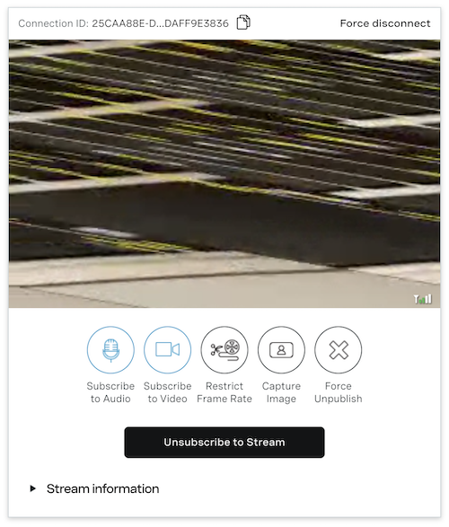

# Description

This is a sample SwiftUI application that takes an augmented reality scene and publishes the video feed to tokbox.

# Running the Sample Application

1. From the terminal, open the base project directory and run `pod install` to install the OpenTok dependency.
2. Open the `TokboxARSample.xcworkspace` workspace file.
3. Generate and enter your **API Key**, **Session ID**, and **Token** into the `Views/SessionView.swift` file.
4. Run the app from Xcode.
5. Open a web browser to the OpenTok Playground https://tokbox.com/developer/tools/playground/ and join the session to observe the transmission.

# Custom AR Video Capture Issue

When publishing an AR frame from a portrait orientation, the view from a subscriber's perspective results in a distorted image:

Transmitting from a landscape orientation works as expected.

This issue started occurring after upgrading Tokbox from version 2.18.0 to 2.20.0.
